## An elementary introduction to GitHub

GitHub is the world's largest community of developers. You can upload your VE280 code to GitHub for backup and version control, collaborate with your teammates in VE280 labs and some later group projects, or even make contributions to the open-source projects of Google, Facebook, etc.

### 1. Create an account

- **Visit the homepage of GitHub:** 
<https://github.com>.

- **Pick your username.** Taking a student named "Shengyi Qian" as an example, here are several preferred naming conventions.
  - `shengyiqian`: Use the Pinyin of your full name.
  
  - `syqian` or `sqian`: If your full name is too long, say 10+ characters, you can use the acronym of your first name.
  
  - `shengyiq`: Using the acronym of your last name is also acceptable.
  
- **Enter your email and password.** Then click "Sign up for GitHub". You can change your username, email or password anytime after registration.

  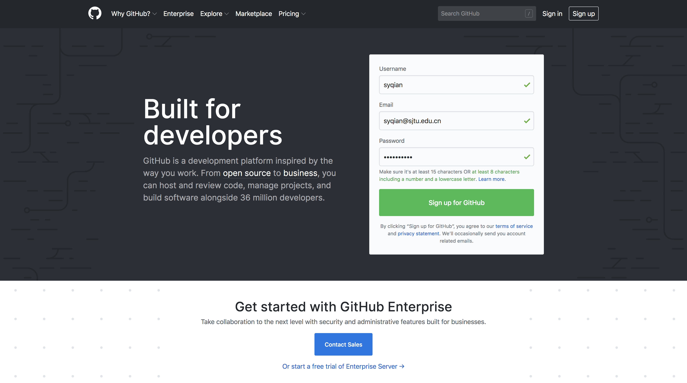
  
- **Set up your account.** Finish the verification in Step 1. For Step 2, please select the **Free** subsciption. You can get access to the **Pro** tools later with the [GitHub Student Developer Pack](https://education.github.com/pack) (not necessary for VE280). Step 3 can be skipped.

  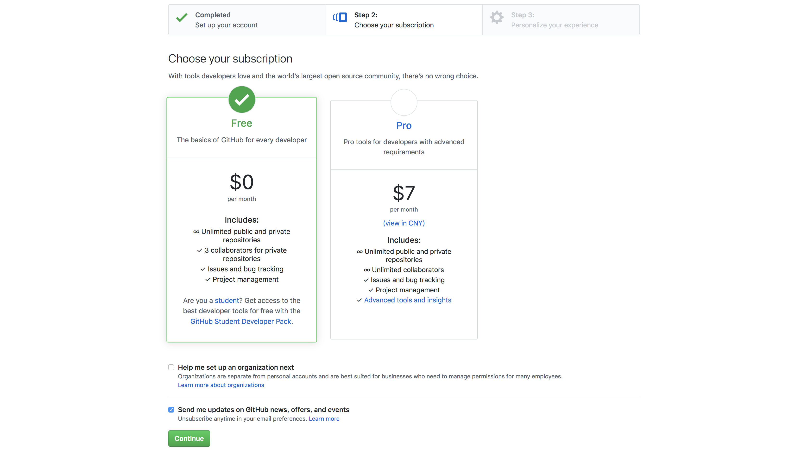
  
- **Verify your email.** Open the link in the verification email sent to your registered email address. This will redirect you to the GitHub homepage. Your account has now been created!

  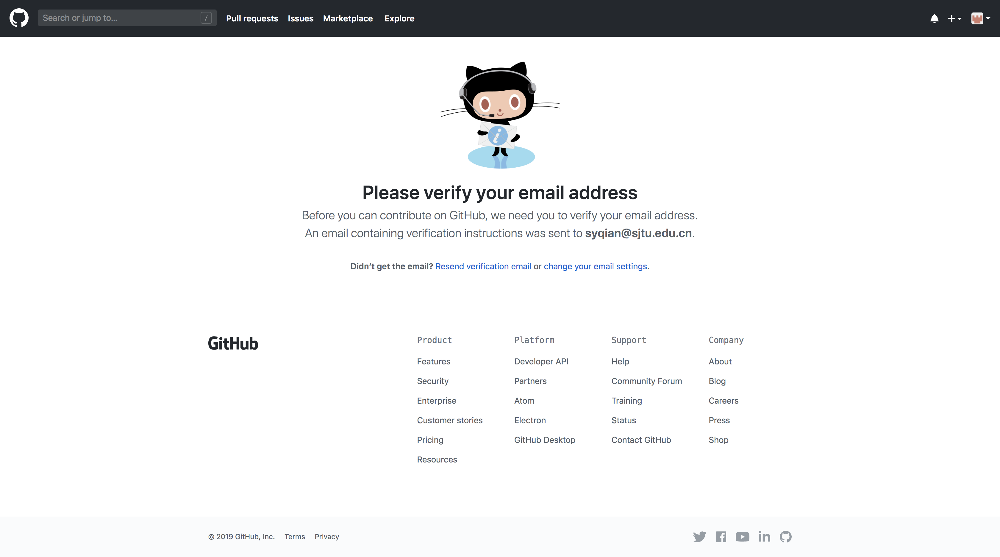

- **Visit your profile.** Click "Your profile" under your avatar at the top-right corner. Your repositories and contributions are displayed here. You can also edit the profile to add more information about yourself.

  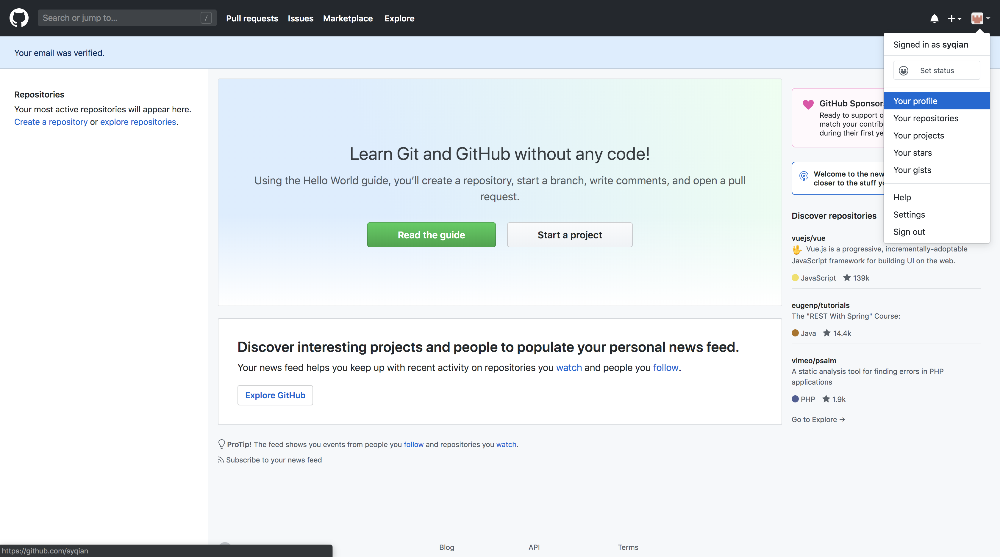

  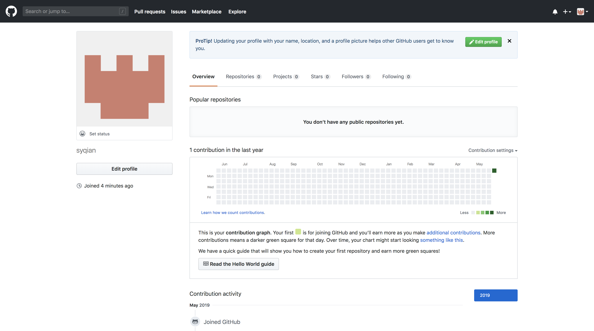
  
### 2. Install Git on your local machine

- **Install Git with default packages.** Following is the Git installation command on Ubuntu. You can also install Git on Windows/Mac.

  ```
  sudo apt install git
  ```
  
- **Set up Git.** Once you have Git installed, you should configure it with your name and email address.

  ```
  git config --global user.name "Shengyi Qian"  # Replace with your name
  git config --global user.email "syqian@sjtu.edu.cn"  # Replace with your email
  ```
  
  
### 3. Use a private repository

- **Create a private repository.** Click "New" on the GitHub homepage, or simply go to <https://github.com/new>. This is the repository creation page. We usually create a repository for each project. Enter a repository name, for example, `ve280-p1-integers`. Our recommended naming convention is `lower-case-with-hyphens`. You must choose "Private" below, otherwise your code can be seen by anyone. Then check "Initialize this repository with a README" and select "C++" under "Add .gitignore". If you are interested, you could learn more about [README](https://help.github.com/en/articles/about-readmes) and [.gitignore](https://help.github.com/en/articles/ignoring-files). Click "Create repositary" at last.

  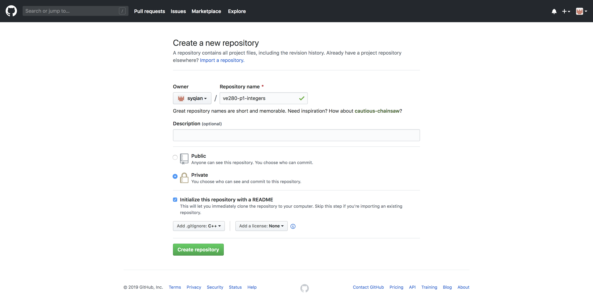
  
- **Visit the repository page.** The URL of a GitHub repository is `https://github.com/<username>/<repository-name>`, e.g. <https://github.com/syqian/ve280-p1-integers>. There are also repository links on the GitHub homepage or your profile page.

  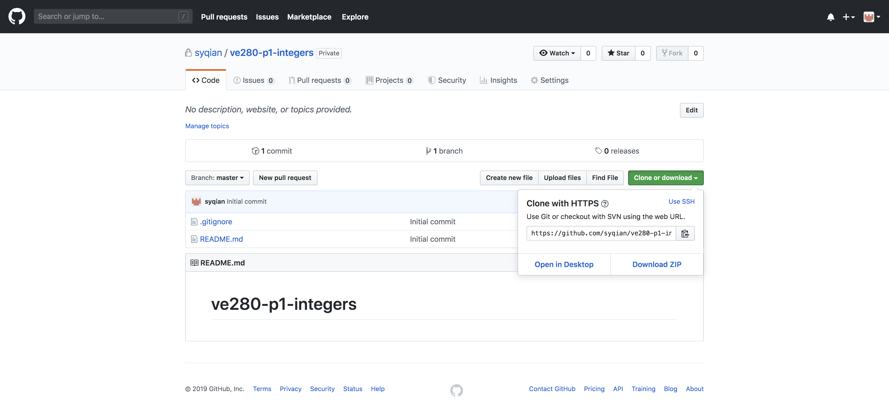
  
- **Clone the repository to your local machine.** Click the "Clone or download" button on your repository page and copy the URL. Then go to your Ubuntu terminal, change to some directory you'd like to store your code in, and paste the link into the `git clone` command. This will create a folder with your repository name, where you can put all the code of this project, e.g. `p1.cpp`.

  ```
  cd ~
  git clone https://github.com/syqian/ve280-p1-integers.git  # Replace with your URL
  cd ve280-p1-integers
  touch p1.cpp
  ```
  
- **Make a commit to GitHub.** 

  After you've written some code in `p1.cpp`, you need to add these changes.

  ```
  git add p1.cpp
  ```
  
  Write a message for this commit, which will be shown in your commit history.
  
  ```
  git commit -m "Finish part 1 Triangle number"
  ```
  
  Push the commit to your remote GitHub repository.
  
  ```
  git push -u origin master
  ```
  
  Now visit your repository page again and you'll find your latest update there.
  
- **Add a collaborator to your repository.**

  If you are working on a group project, you can go to the repository page and add a collaborator under "Settings" -> "Collaborators". This will send an invitation email to your teammate.
  
  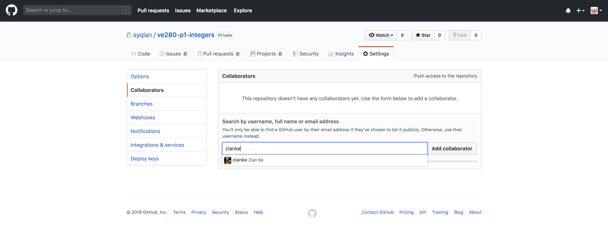
  
  After clicking "Accept invitation", your teammate will be able to access all your code and make commits to your repository too.
  
  
  

### 4. Contribute to a public repository

- **Fork a repository.** You can contribute to a public repository even if you are not one of its collaborators. Just go to the repository page, e.g. <https://github.com/ve280/ve280> (VE280 course repository), and click "Fork" at the top-right corner. The forked repository will be at `<https://github.com/<username>/ve280>`, e.g. <https://github.com/syqian/ve280>.

  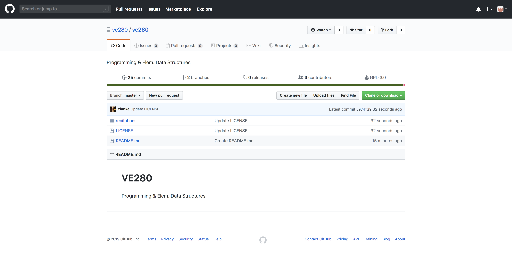

  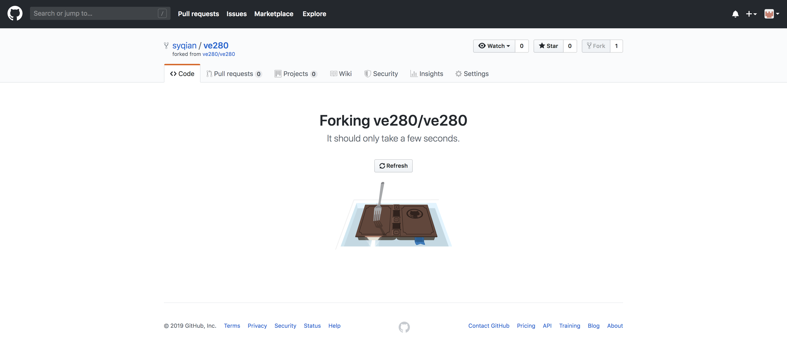

  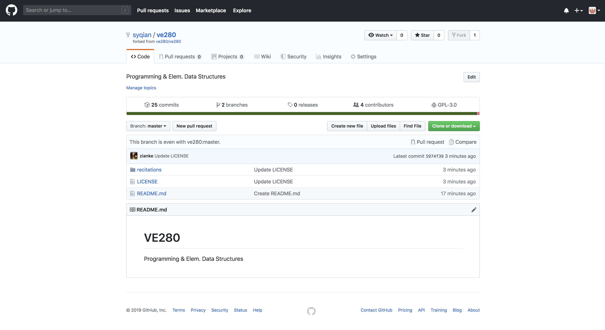
  
- **Update some file.** The most common way to commit to a forked repository is exactly the same as how you commit to your own private repositories. You can `git clone` the forked repository to your local machine, make some changes, and use the `git add`, `git commit`, `git push` commands as shown in Section 3 of this tutorial. However, an alternative way is to edit some file directly on the forked repository page. Simply click a file, e.g. `README.md` on <https://github.com/syqian/ve280>, then click "Edit this file".

  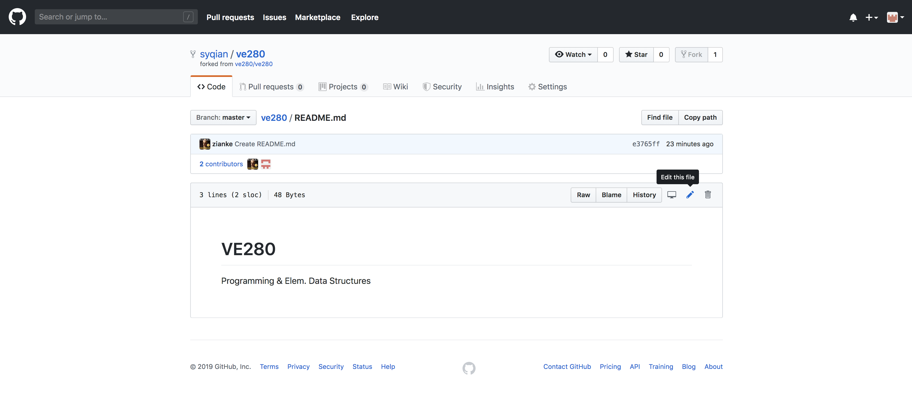
  
  Then you can update the file content using the text editor and click "Commit changes" at the bottom of this page.
  
  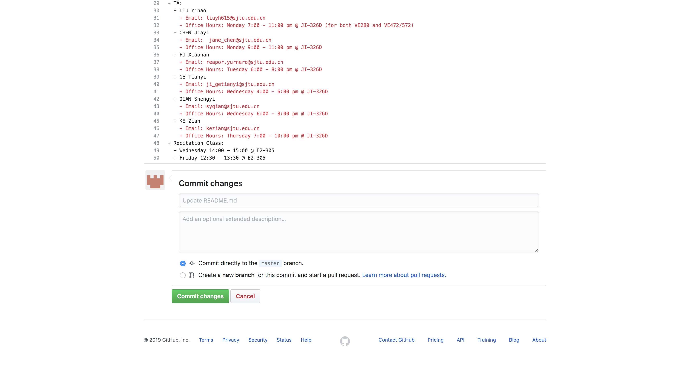
  
- **Create a pull request.** Visit the forked repository again, e.g. <https://github.com/syqian/ve280>. Now you should see "This branch is 1 commit ahead of ve280:master". Click the "Compare" button, then click "Create pull request" and confirm.

  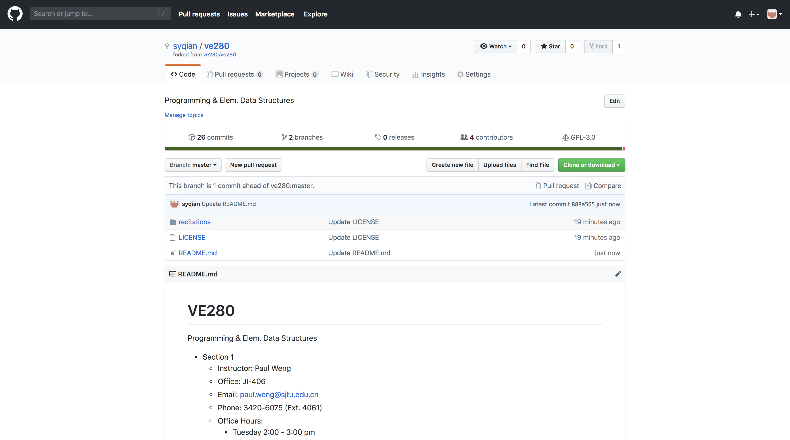

  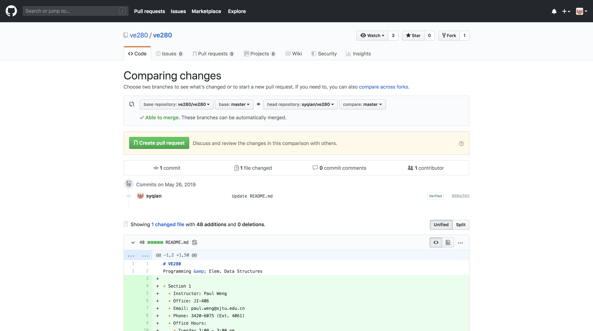

  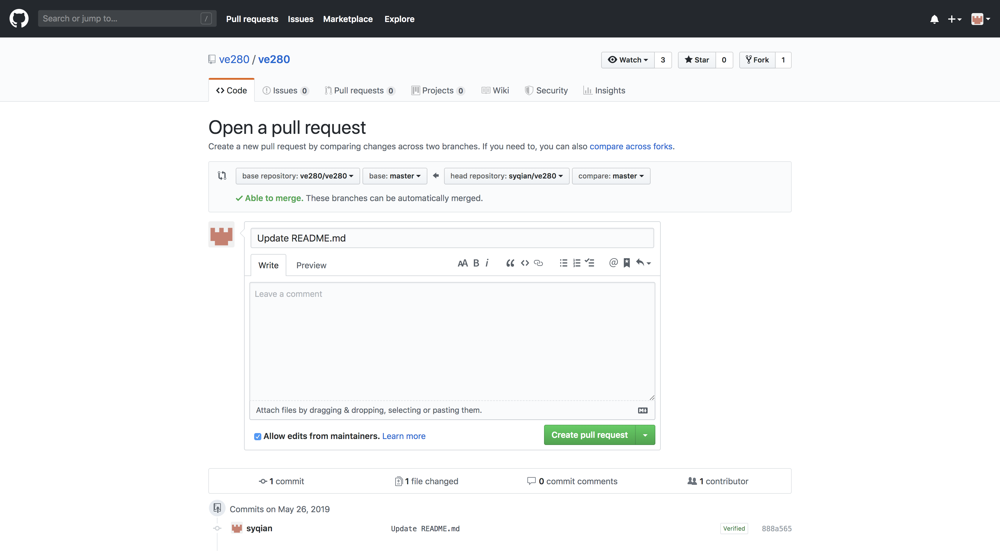
  
  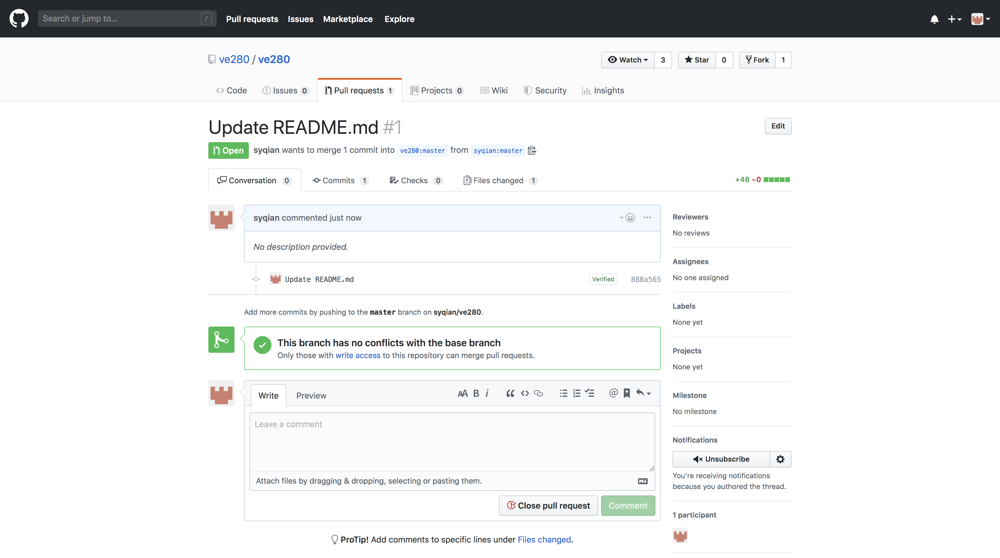
  
  Wait for one of the TAs to review your pull request. If he or she thinks you've made a good update, your commits will be merged into the main repository. Congratulations and you'll be listed in the VE280 [contributors](https://github.com/ve280/ve280/graphs/contributors)!
  
  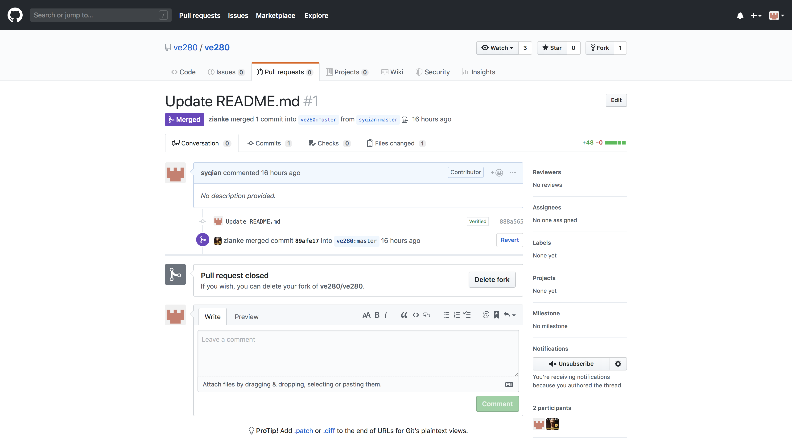
  
  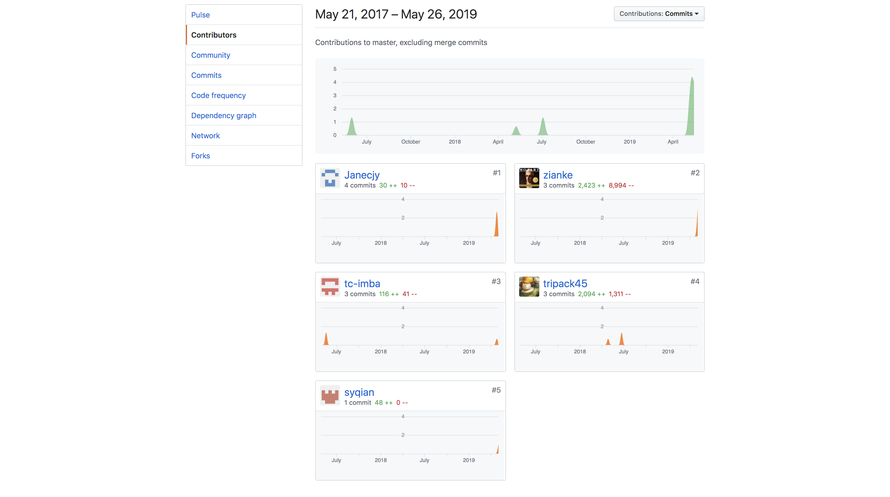


  
- **Star a repository.** If you like a repository, you can go to the repository page, e.g. <https://github.com/ve280/ve280>, and click "Star" at the top-right corner.
