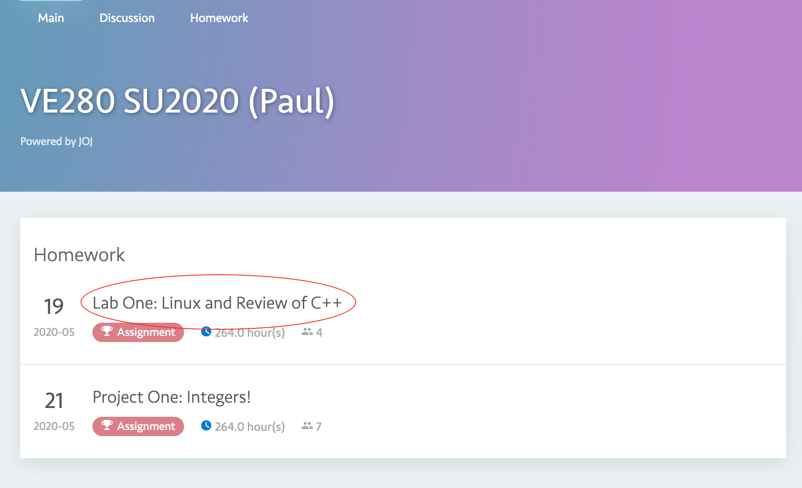
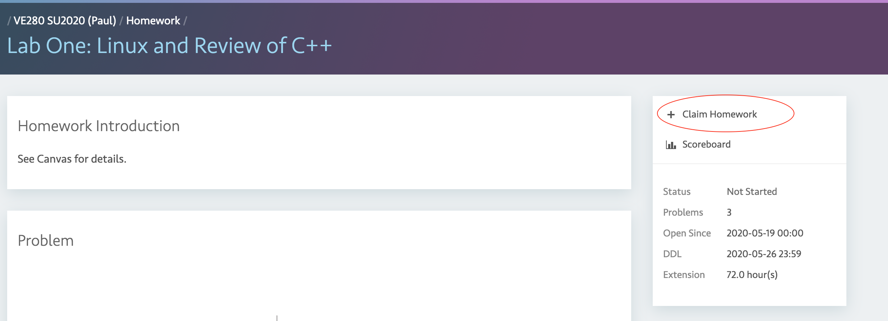
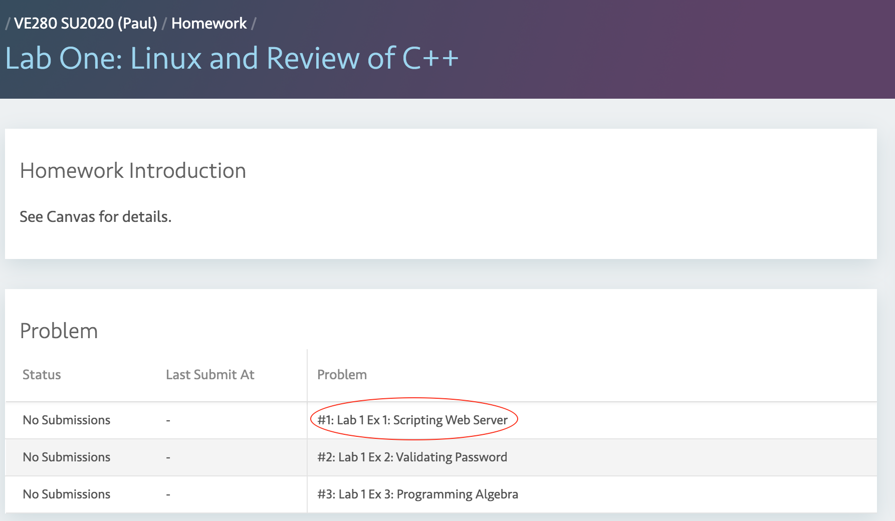
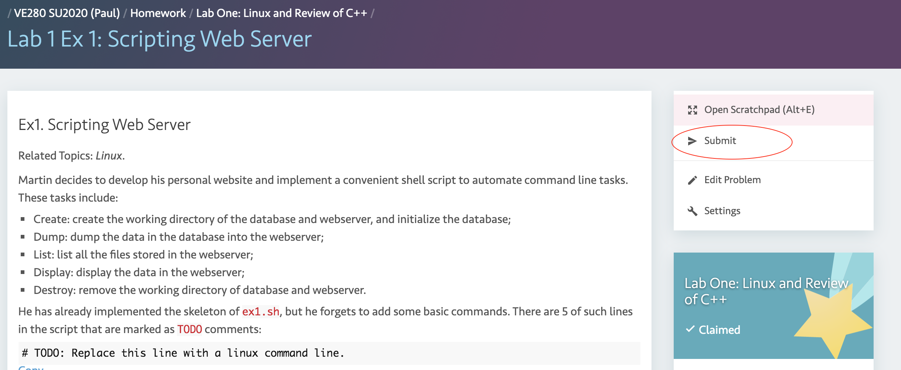
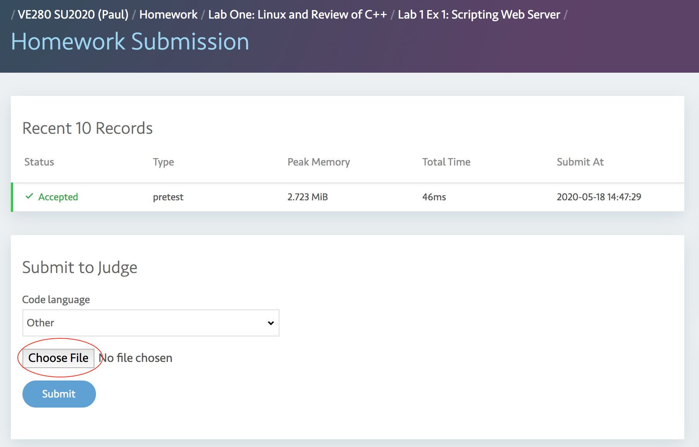
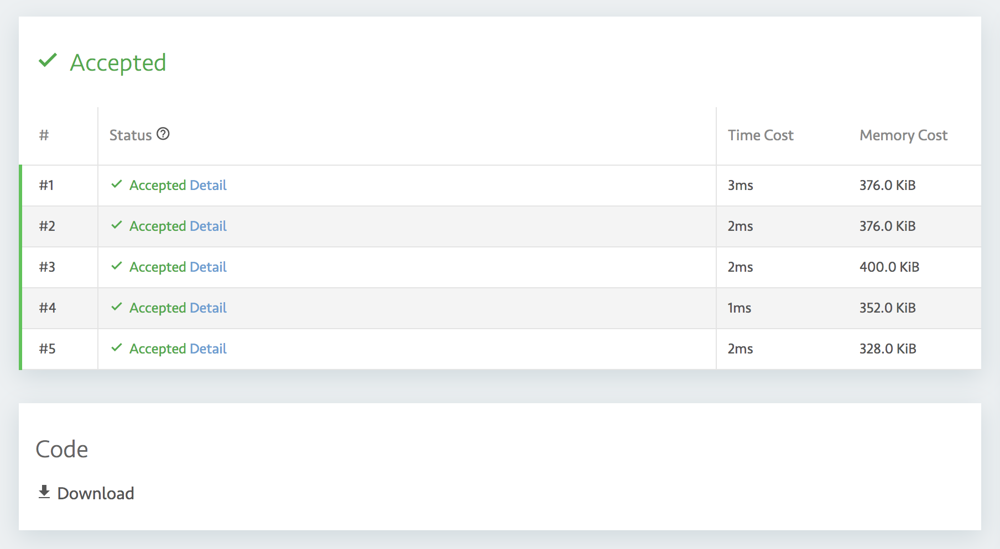

## Submit your VE280 project solution to Joint Online Judge (JOJ)

### 1. Join JOJ

* You may need to log in your jAccount first.

- Students can join the VE280 domain on JOJ by visiting the following URL: 
<http://joj.sjtu.edu.cn/d/ve280_summer_2020/join> and type in the invitation code provided in the announcement for lab1.


### 2. Choose a project

- On the "Main" page or "Homework" page, you can see a list of homework. Though some homework is visible, the content is disabled. For now, please click "Lab One: Linux and Review of C++".

  

- Please click "Claim Homework" on the project page.

  


### 3. Submit your solution

- Once you've finished the lab, please compress your code into a tarball and submit it to JOJ. For Lab One, Exercise One, the tarball contains only `ex1.sh`. You can make it with the following command in your terminal: 

  ```
  tar -cvf ex1.tar ex1.sh
  ```

- __Note__ that the problem is not visible till the time it releases. Open the project page again and click Problem #1: "Lab 1 Ex1: Scripting Web Server". 

  

- Click "Submit" on the problem page. (Please just omit the difference between your page and TA's)

  

- Select `ex1.tar` and click "Submit". Please do not submit `ex1.sh` directly.

  

### 4. View the submission result

- After your submission, the grading results will be automatically displayed. If your solution is not "Accepted" for any test case, please try to debug and improve your solution, then submit it again. You have unlimited chances for submission. Please notice this is only a pretest with 5 test cases. After the due date of Lab One, TAs will run the complete test suite which contains other cases. We strongly encourage you to design your own test suite and take every corner case into consideration. Good Luck!

  

### Acknowledgement

- Special thanks to [Yihao Liu](https://github.com/tc-imba) for developing JOJ. The project repository is <https://github.com/joint-online-judge/cb4>.