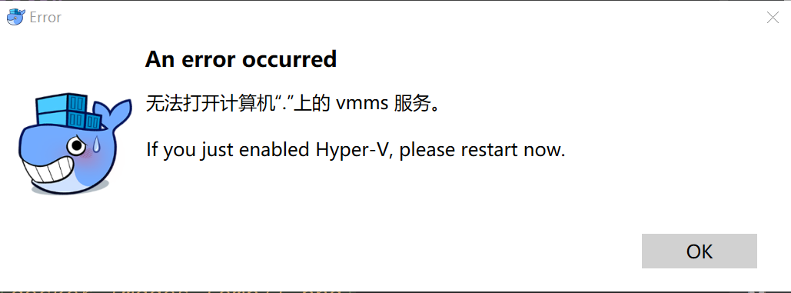
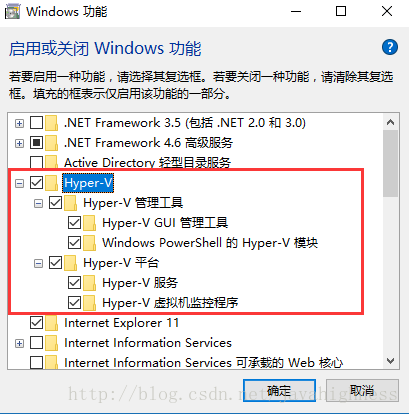
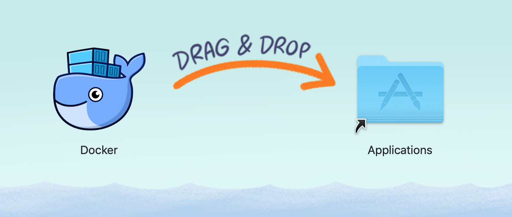
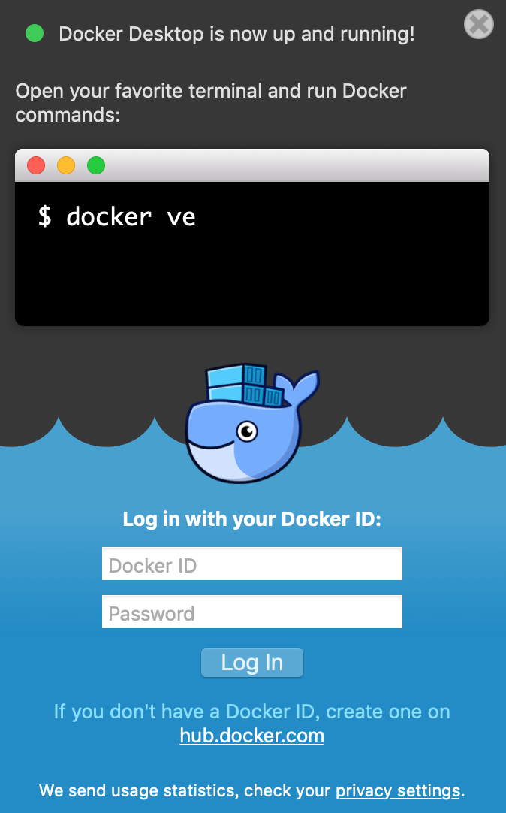
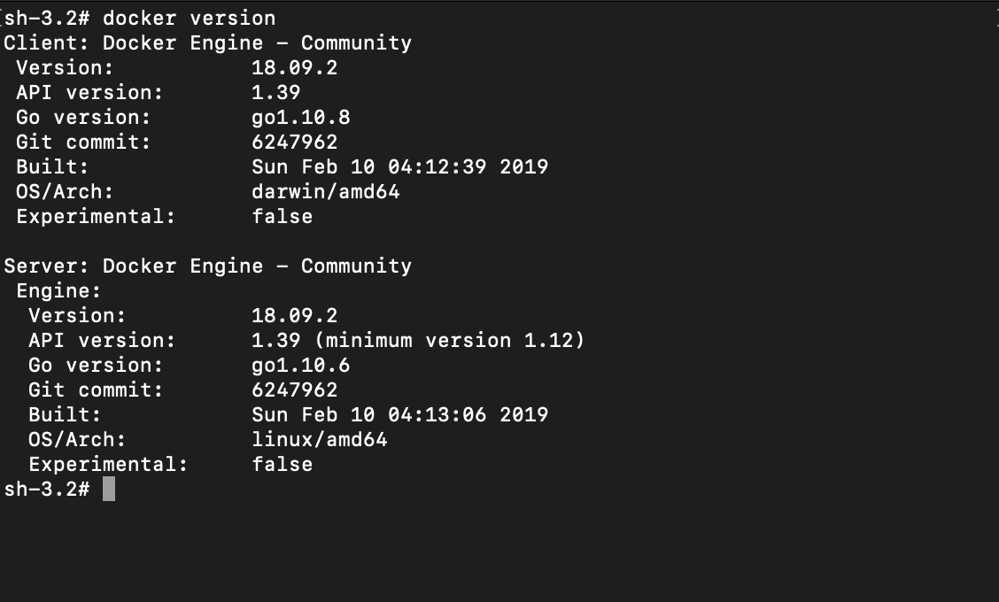
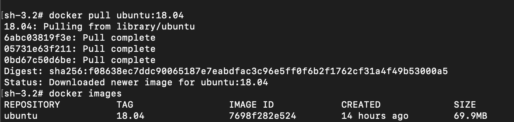

## How to install Linux on Docker

### 1. Install Docker

The tutorial about how to install docker on each platform are available on 
<https://docs.docker.com/install/>

Generally, you can download the installer according to your system.

#### Windows 10

Actually WSL is preferred on Windows 10, but you can also try Docker. 

1. Download 
<https://download.docker.com/win/stable/Docker%20for%20Windows%20Installer.exe>
and install it

2. Run the Docker Desktop app and wait until it is up and running, and close it. You may meet an error about the Hyper-V service, and then you need to open it and restart your computer.

3. Open your favorite terminal and run `docker version` to verify the installation

#### Windows 7 or below

Old versions of docker may be supported on Windows 7 or below, but it is not recommended for you to use these systems now.

#### Mac OS:

1. Download 
<https://download.docker.com/mac/stable/Docker.dmg>
and install it.

2. Run the Docker Desktop app and wait until it is up and running, and close it.

3. Open your favorite terminal and run `docker version` to verify the installation

#### Linux 

You may notice that docker can be installed on Linux, and performs much better on it! The official release of docker supports CentOS, Debian, Fedora, Ubuntu and most other Linux distributions.

### 2. Create a Linux Image with Docker

You can find various images of Linux Distributions on 
<https://hub.docker.com/search?category=os&source=verified&type=image>. Here is brief list of it:

+ ubuntu: <https://hub.docker.com/_/ubuntu> (Ubuntu is a Debian-based Linux operating system based on free software.)
+ alpine: <https://hub.docker.com/_/alpine> (A minimal Docker image based on Alpine Linux with a complete package index and only 5 MB in size!)
+ centos: <https://hub.docker.com/_/centos> (The official build of CentOS.)
+ debian: <https://hub.docker.com/_/debian> (Debian is a Linux distribution that's composed entirely of free and open-source software.)
+ amazonlinux: <https://hub.docker.com/_/amazonlinux> (Amazon Linux provides a stable, secure, and high-performance execution environment for applications.)
+ fedora: <https://hub.docker.com/_/fedora> (Official Docker builds of Fedora)
+ and many others

First you should choose a Linux Distributions on your favour, the following tutorial will take ubuntu 18.04 as an example. But if you choose other docker images, the procedure will be very similar, you only need to change the image and container names.

The following commands can be ran on any OS with docker installed.

1. Open your favorite terminal.
2. Run the command `docker pull ubuntu:18.04` to pull an image. (image_name:tag_name, the image names are in the list above, and the tag names can be found in the "tags" on docker hub pages)
3. run the command `docker images` to verify the download of the image.

4. Run the command `docker run -dit --name ubuntu ubuntu:18.04` to run a ubuntu container. (the name option can be arbitrary, but you can not use the same name for two containers)
5. Run the command `docker exec -it ubuntu /bin/bash` to enter the container by launching a `bash` process on it.
6. Use Ctrl+D or `exit` to exit the container, and run the command `docker ps` to check the status of running containers.

### 3. Use a Docker Container

When you enter the container with a shell (eg. `bash`), you can use the container just like it is installed on a bare machine.

If you restart your system, the docker containers will be stopped, then you can run the command `docker start ubuntu` to start the container before you enter it.

