## How to install Ubuntu 18.04 LTS alongside with Win10

### 1. Make a backup [Optional]

**It's always wise to make a backup.** Backup your important files in advance in case something unexpected occurs.

### 2. Downloading Ubuntu image

For this part, you could go to [How to install Ubuntu 18.04 LTS on VirtualBox](https://github.com/ve280/tutorials/blob/master/ubuntu_installation_virtualbox.md).

### 3. Prepare a bootable USB

- **In Win10 OS, press win+R and type `msinfo32.exe`** This step is to check if your Win10 is booted in UEFI or Legacy BIOS mode. In the right pane of **System Summary**, you can see the **BIOS Mode** line. 

  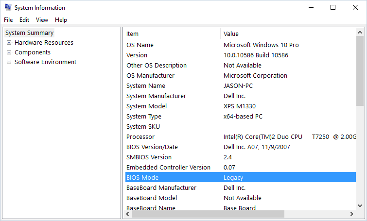

  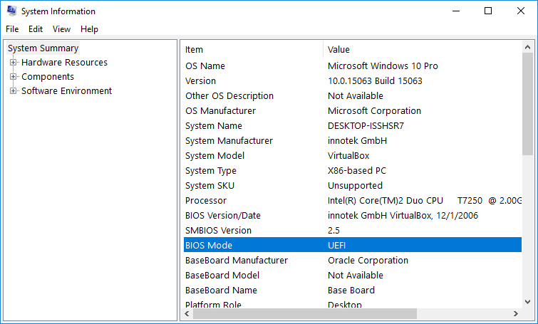

- **Install Rufus USB creater** You can download Rufus from [here](https://rufus.akeo.ie/).

- **If it's UEFI, plugin your USB disk and apply the following settings**

  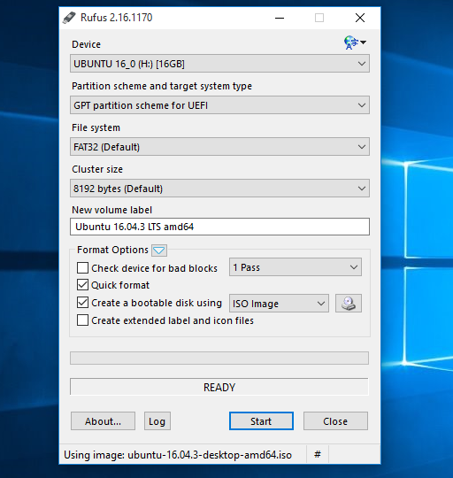

### 4. Partition the disk on Win10 [Optional]

- **If you install Ubuntu on another hard drive, you may skip this step.**

- **Open Disk Management of Win10.**

  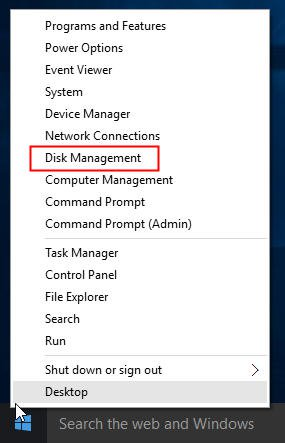

- **Shrink the volume to desired size** Select the hard drive partition you want to shrink. The size depends on the free space on your hard drive. At least 10 GB and 20 GB is recommended. 

  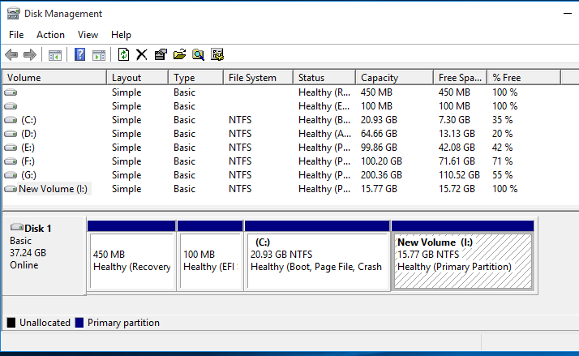
  
  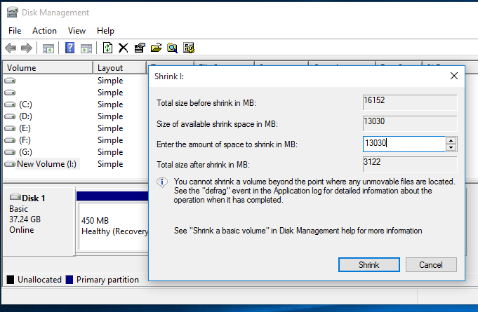
  
  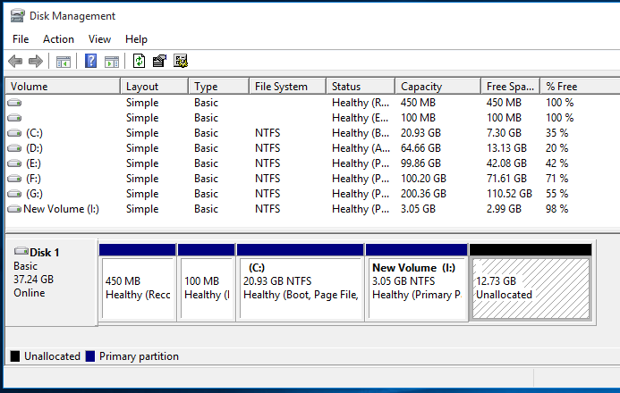

### 5. Reboot the computer and boot from USB

- **You may try `F12`, `F10`, `F8` to enter**. On Dell, Acer, Lenovo or Toshiba laptops, it's the `F12` in most cases. Sometimes `Fn` is required (e.g. `Fn` + `F12`) In **Boot Option Menu**, Move the priority of your USB to the first. The interface varies a little from laptop to laptop.

  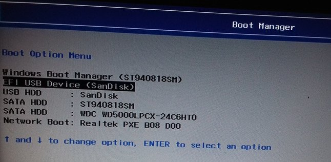

- **Turn off Secure Boot.** Find the **Secure Boot** setting, and if possible, set it to **Disabled**. This option is usually in either the **Security** tab, the **Boot** tab, or the **Authentication** tab.

- **Save and reboot**

### 6. Install Ubuntu

- **Select `Install Ubuntu`** The procedure is similar to that of [How to install Ubuntu 18.04 LTS on VirtualBox](https://github.com/ve280/tutorials/blob/master/ubuntu_installation_virtualbox.md). 

- **You may skip and continue as well.**

  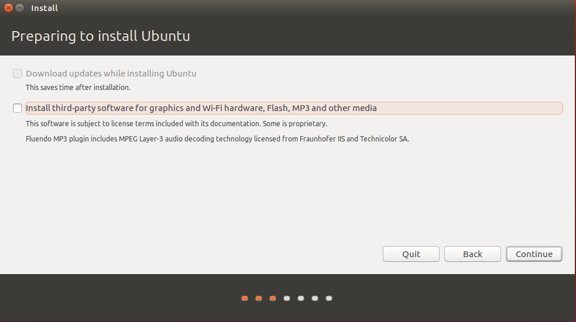

- If you want to keep your Windows system, select **Something else** as **Installation type**.

  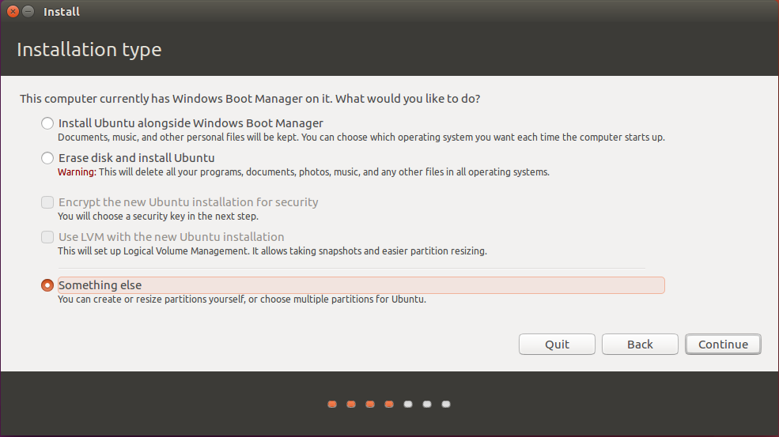

- **Choose the partition you just created.**
  
  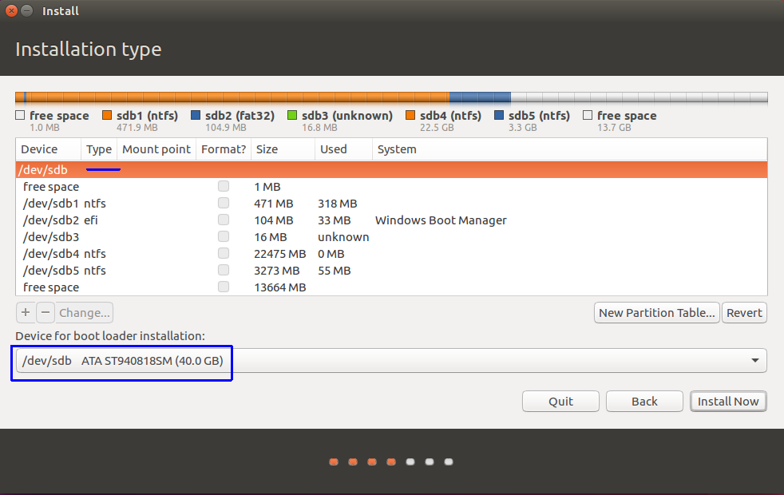

- **Create root `/`, swap and home `/home`.** Select **free space**. Click `+`. You could reference the following settings. The `swap area` is recommended to be larger than 6 GB. The `/home` is where you put your personal files, thus make sure it's large enough. Make sure that everything is correct before you click `Install Now`.

  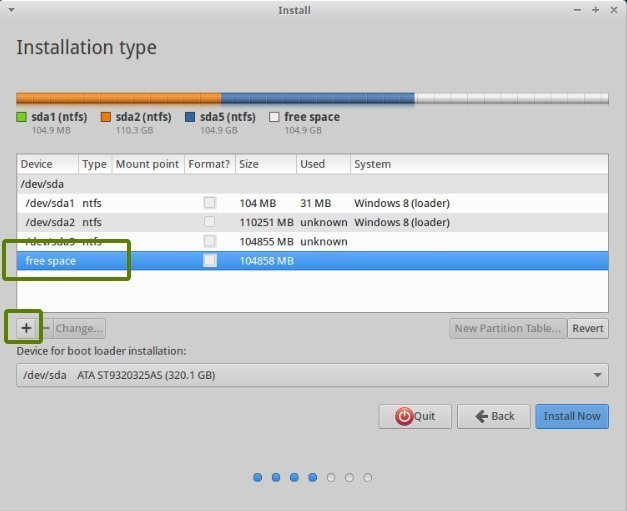

  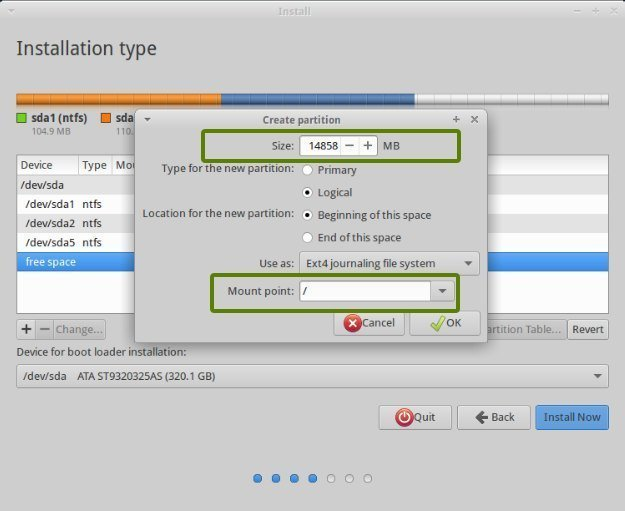

  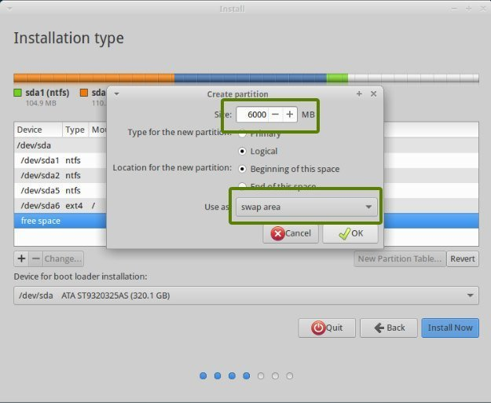

  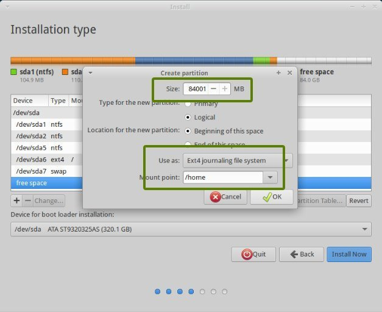

  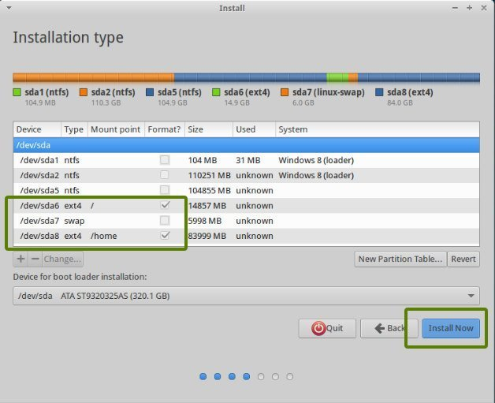

### 7. Reboot and select `Ubuntu`

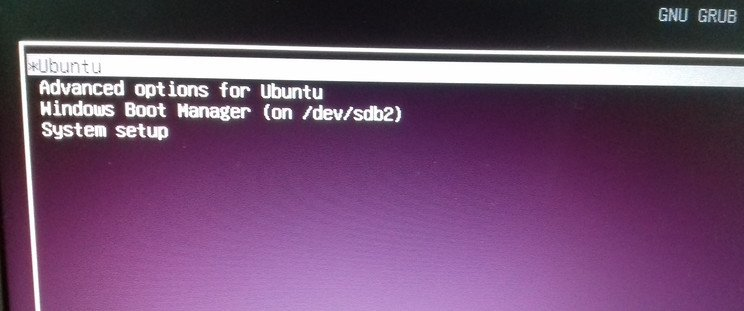

#### Reference

1. <https://www.easyuefi.com/resource/check-windows-is-booted-in-uefi-mode.html>
2. <https://tutorials.ubuntu.com/tutorial/tutorial-create-a-usb-stick-on-windows#3>
3. <https://www.pcsuggest.com/dual-boot-windows-10-and-ubuntu-uefi/>
4. <https://www.disk-partition.com/windows-10/windows-10-disk-management-0528.html>
5. <https://itsfoss.com/install-ubuntu-dual-boot-mode-windows/>
6. https://docs.microsoft.com/en-us/windows-hardware/manufacture/desktop/disabling-secure-boot