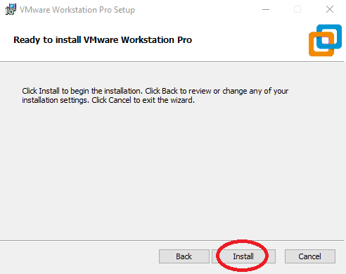

## How to install Ubuntu 18.04/20.04 LTS on VMware Workstation/Fusion

### 1. Download Ubuntu image

- **Open the Ubuntu website.** Go to the official website <https://www.ubuntu.com/download/desktop>. You can download the Ubuntu disk image (also known as an ISO file) here. For VE280 SU2020, both **Ubuntu 20.04 LTS** and **Ubuntu 18.04.2 LTS** are recommended. We'll take the latest version as an example. You can find older releases on <https://releases.ubuntu.com>.

  

### 2. Download VMware Workstation/Fusion

- **For SJTUers.** SJTU provides free version of VMware at this link: <http://vmap.sjtu.edu.cn>. Login with jAccount, then you can see all the available products. For Mac users, please choose **VMware Fusion 11.x Pro (for Intel-based Macs)**. For Windows users, please choose **VMware Workstation 15.x Pro**. We'll use VMware Fusion in this tutorial. But the steps of VMware Workstation should be similar.

  

- **Click "Add to Cart".**

  

  

- **Click "Check Out".**

  

- **Fill in the "Contact Information" section.** Then click "Proceed with Order". You'll be shown with the order details.

  

- **Keep your Serial Number.** Copy your Serial Number to somewhere in order to make it persistent. You'll need this to activate VMware Fusion on your Mac. Then click "Download".

  

- **For free trial.** If you don't have a valid SJTU account, you can download a 30-day free-trial version on <https://www.vmware.com>. Login the website. If you don't have an account, sign up first.

  

  

  
  
  
  
  
  
  
### 3. Install VMware Workstation/Fusion.

#### 4.1 For VMware Fusion

After the download is finished, you can install VMware Fusion on your Mac. Please paste your Serial Number here and click "Continue". 

  

#### 4.2 For VMware Workstation

- **Run VMware-workstation-full-15.5.2-15785246.exe.**

  

  

  

  

  

  
  
  
  
  

- **Run VMware Workstation Pro and input the license key.**

  

  

### 4. Install Ubuntu in VMware Workstation/Fusion

#### 4.1 For VMware Fusion

- **Click "+".** On the top-left of the main screen there’ll be a “+” button. Click on it and choose “New…” to create a new VM.

  

- **Drag the ISO file icon onto the drop target.** The new virtual machine window will pop up, ready to go. Simply drag the ISO file icon onto the target marked by the red circle.

  

- **Click "Continue".** Once the file image is loaded, VMware Fusion for Mac will automatically move to the next step.  VMware Fusion is smart enough to go through the entire Linux setup process without bothering you at all, so this is where you specify your basic account and password. If you want to be able to access your main Mac desktop while within Ubuntu, check “Make your home folder accessible to the virtual machine” too. Then click “Continue”.

  

- **Click "Finish".** VMware Fusion for Mac completes all the work for you.

#### 4.2 For VMware Workstation

- **Click "Create a New Virtual Machine".**

- **Click "Next >"**

- **Choose installer disc image file and Click "Next >"**

- **Personalize Linux**

- **Name the Virtual Machine**

- **Specify Disk Capacity**

- **Ready to Create Virtual Machine**

### 5. Enjoy your journey on Linux

You’ll be prompted to log into your new Ubuntu virtual machine. 

**Ubuntu 18.04 LTS**

**Ubuntu 20.04 LTS**

#### Reference

1. <https://www.askdavetaylor.com/install-ubuntu-linux-vmware-fusion-mac>
2. <http://www.macinstruct.com/node/394>