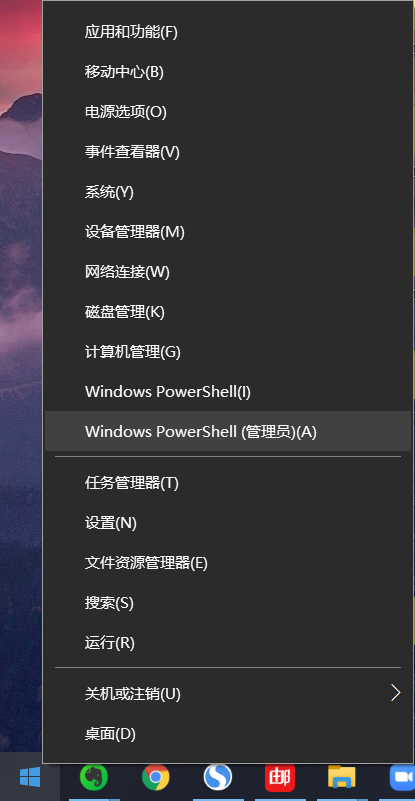
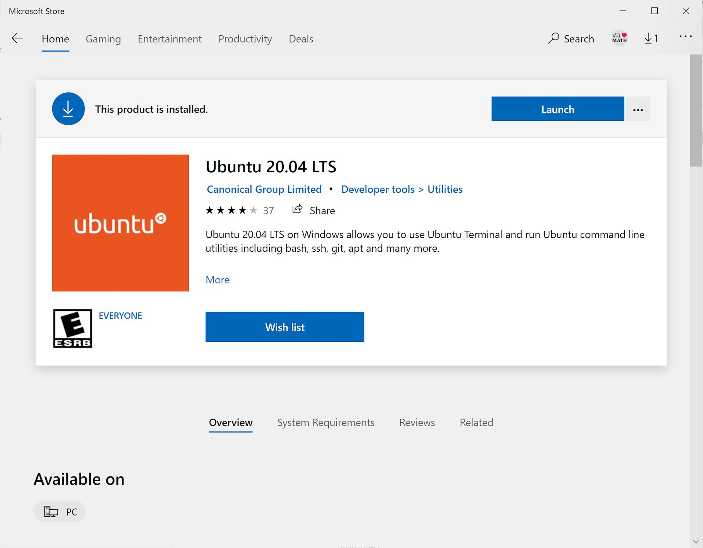
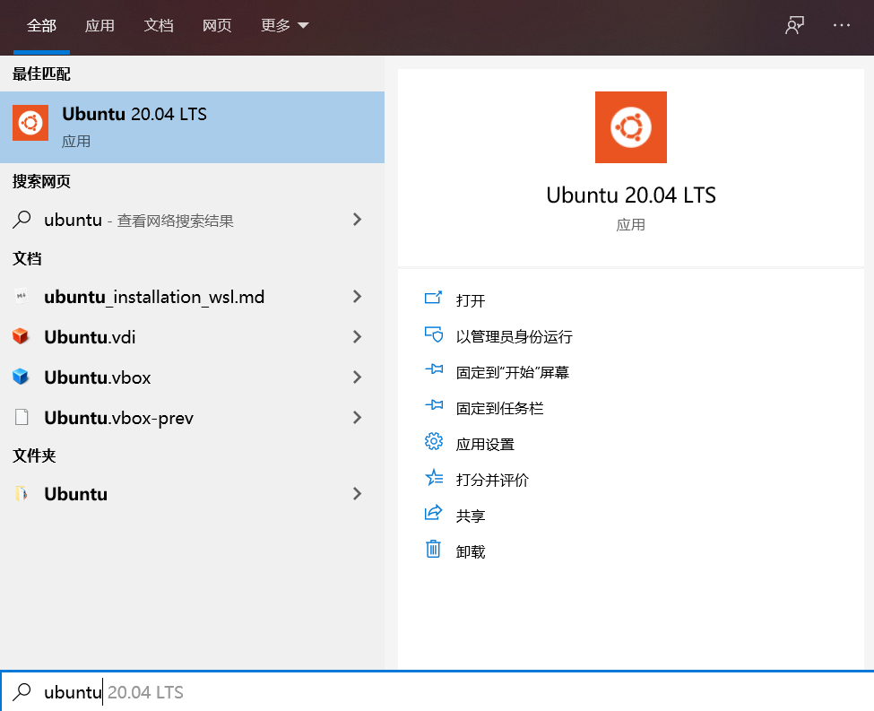
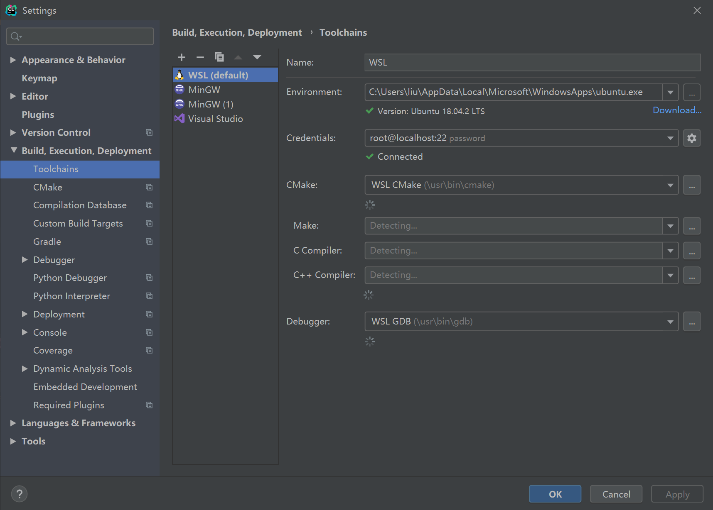
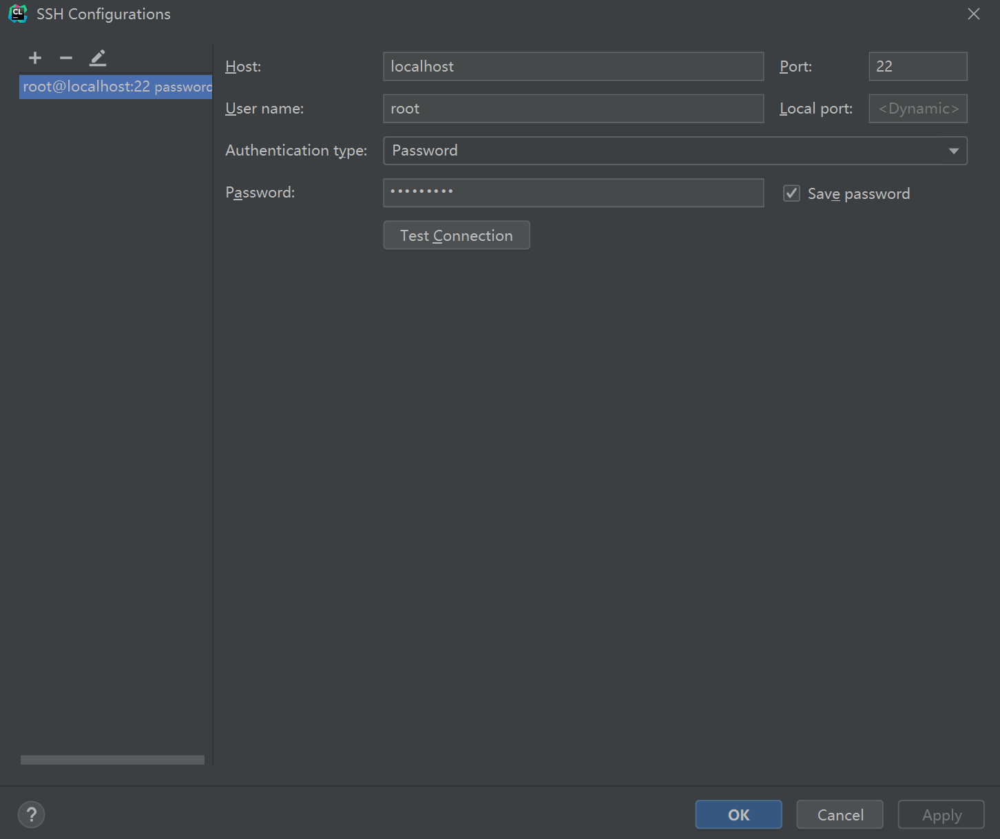
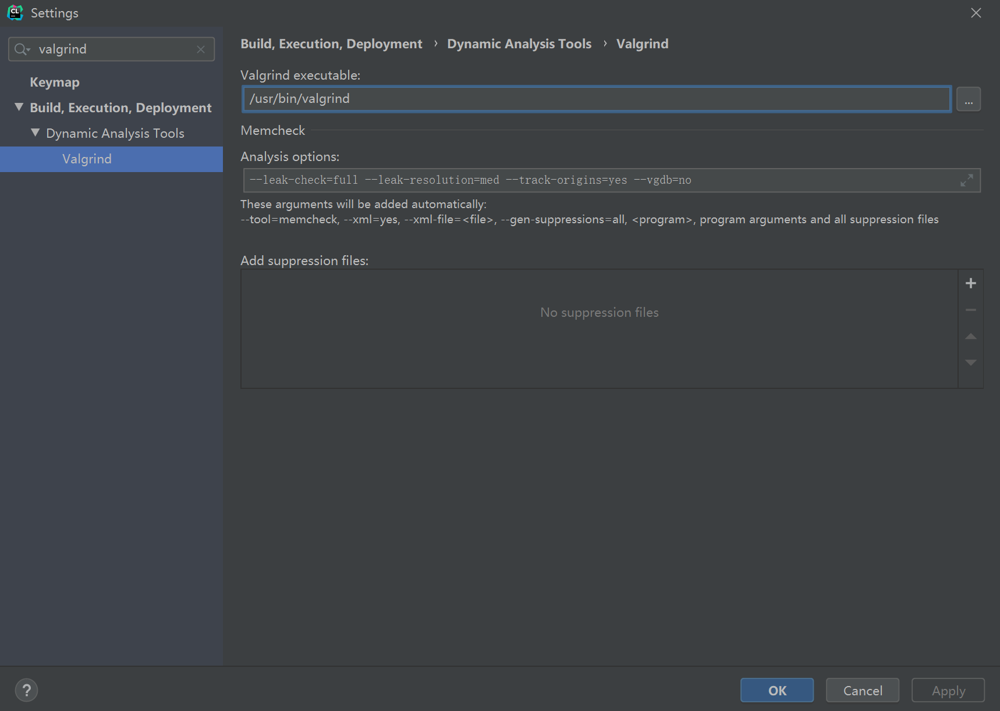
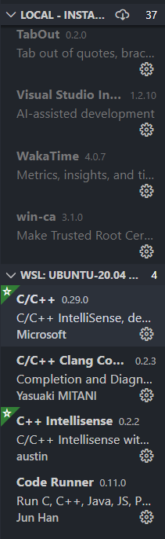

## [How to install Windows Subsystem for Linux (WSL) on Win10](https://github.com/ve280/tutorials/blob/master/ubuntu_installation_wsl.md)


## Part A - Linux Installation (By Changyuan Qiu)

### Install the Windows Subsystem for Linux

- Call `Win+X` button and Press `A` to open *PowerShell* as Administrator.

  

- run:

  ```
  dism.exe /online /enable-feature /featurename:Microsoft-Windows-Subsystem-Linux /all /norestart
  ```

- Restart your computer.

  

### Install your Linux distribution of choice

- Open the [Microsoft Store](https://aka.ms/wslstore) and select your favorite Linux distribution.

  

  

- The recommended version for VE280 FA2020 are **Ubuntu 18.04 LTS** and **Ubuntu 20.04 LTS** (both would be fine).

  The following links will open the Microsoft store page for each distribution:

  - [Ubuntu 16.04 LTS](https://www.microsoft.com/store/apps/9pjn388hp8c9)

  - [Ubuntu 18.04 LTS](https://www.microsoft.com/store/apps/9N9TNGVNDL3Q) (recommended)

  - [Ubuntu 20.04 LTS](https://www.microsoft.com/store/apps/9n6svws3rx71) (latest and recommended, approximately 440+MB)

    

- From the distribution's page, Click the blue “Get”
  button, and then click the blue “Install” button.
  
  After installing the product, your screen should look something like this.
  
  
  
  
  
  Click the blue “Launch” button to launch Ubuntu from the Microsoft Store.
  
  
  
- Ubuntu will go through a one-time installation automatically. When
  prompted, enter a username and password. The username and password
  do not need to be the same as your Windows username and password. 
  
  **The username and password are important for navigating your WSL file system and running Linux command-line tools, so don’t forget them!** For the rest of this guide, your WSL username will be referred to as `<username>`, and your WSL password will be referred to as `<password>`. Your Windows username will be referred to as `<win-username>`.
  
  If you unfortunately forget about your password, please refer to [Appendix II](#appendix-II:-forget-about-your-password?)
  
  


### Enjoy your journey on Linux

+ After Ubuntu has completed its one-time installation, you can launch
  Ubuntu from several locations. 

  + Launch Ubuntu from the Microsoft Store as seen previously. 
  + Open the *PowerShell* and call the command `bash` .
  + Search for "Ubuntu" in the search bar at the bottom of your screen (or simply call `Win+S` and type in "Ubuntu") and click on the application that appears in the results. 

  

  

+ When you launch Ubuntu, you will start at the directory
  `~`, or `/home/<username>`.

  This directory is located within the WSL file system. **If you choose to**
  **uninstall WSL, all files within the WSL file system, or all files at this**
  **directory, will be deleted.**  

+ If you wish to access your Windows file system from within Ubuntu, you can change directories by running the command. **(DO NOT TYPE '<' or '>'!!!)**

  ```
  cd /mnt/c/Users/<win—username>    
  ```

  To return to your WSL file system, you can run the command `cd ~` or `cd /home/<username>` **(DO NOT TYPE '<' or '>'!!!)**.

+ For other common commands for the Linux command line, please refer to related course slides, or [the third website in the Reference](#reference).

  To run `sudo` commands, you’ll need to enter your `<password>` when prompted.
  
  

---

### Appendix I: Troubleshooting installation

Below are related errors and suggested fixes. Refer to the [WSL troubleshooting page](https://docs.microsoft.com/zh-cn/windows/wsl/troubleshooting) for other common errors and their solutions.

- **Installation failed with error 0x80070003**
  - The Windows Subsystem for Linux only runs on your system drive (usually this is your `C:` drive). Make sure that distributions are stored on your system drive:
  
  - Open **Settings** -> **Storage** -> **More Storage Settings: Change where new content is saved** 
  
- **WslRegisterDistribution failed with error 0x8007019e**
  
  - The Windows Subsystem for Linux optional component is not enabled:
  
  - Open **Control Panel** -> **Programs and Features** -> **Turn Windows Feature on or off** -> Check **Windows Subsystem for Linux** or using the PowerShell cmdlet mentioned at the beginning of this article.
  
- **Installation failed with error 0x80070003 or error 0x80370102**
  
  - Please make sure that virtualization is enabled inside of your computer's BIOS. The instructions on how to do this will vary from computer to computer, and will most likely be under CPU related options.
  
- **The requested operation could not be completed due to a virtual disk system limitation. Virtual hard disk files must be uncompressed and unencrypted and must not be sparse.**
  - Deselect “Compress contents” (as well as “Encrypt contents” if that’s checked) by opening the profile folder for your Linux distribution. It should be located in a folder on your Windows file system, something like: `USERPROFILE%\AppData\Local\Packages\CanonicalGroupLimited...`
  - In this Linux distro profile, there should be a LocalState folder. Right-click this folder to display a menu of options. Select Properties > Advanced and then ensure that the “Compress contents to save disk space” and “Encrypt contents to secure data” checkboxes are unselected (not checked). If you are asked whether to apply this to just to the current folder or to all subfolders and files, select “just this folder” because you are only clearing the compress flag. After this, the `wsl –set-version` command should work.


- **The term 'wsl' is not recognized as the name of a cmdlet, function, script file, or operable program.**

  - Ensure that the [Windows Subsystem for Linux Optional Component is installed](https://docs.microsoft.com/zh-cn/windows/wsl/install-win10#enable-the-virtual-machine-platform-optional-component). Additionally, if you are using an ARM64 device and running this command from PowerShell, you will receive this error. Instead run `wsl.exe` from [PowerShell Core](https://docs.microsoft.com/zh-cn/powershell/scripting/install/installing-powershell-core-on-windows?view=powershell-6), or Command Prompt.

    


### Appendix II: Forget about your password?

+ Call `Win+X` button and press `A` to open *PowerShell* as Administrator.

+ For Ubuntu 20.04, run

  ```
  ubuntu2004.exe config --default-user root
  ```

  For Ubuntu 18.04, run

  ```
  ubuntu1804.exe config --default-user root
  ```

+ run `bash` to call out the WSL.

+ In WSL, run **(DO NOT TYPE '<' or '>'!!!)**

  ```
  passwd <username>
  ```

  And then WSL will prompt you to type in your new password.

+ run `exit` to exit WSL and return to the *Powershell*.

+ For Ubuntu 20.04, run **(DO NOT TYPE '<' or '>'!!!)**

  ```bash
  ubuntu2004.exe config --default-user <username>
  ```

  For Ubuntu 18.04, run

  ```
  ubuntu1804.exe config --default-user <username>
  ```


---

### Contact

This guide was written by [@PeterQiu0516](https://github.com/PeterQiu0516) on 09/02/2020. 

For any questions or issues, please contact peterqiu@umich.edu or check out the resources below.


### Reference

1. What is the Windows Subsystem for Linux? 

   https://docs.microsoft.com/en-us/windows/wsl/about 

2. Frequently Asked Questions about Windows Subsystem for Linux 

   https://docs.microsoft.com/en-us/windows/wsl/faq 

3. The Linux Command Line for Beginner

   https://ubuntu.com/tutorials/command-line-for-beginners#1-overview


---

## Part B - Apt Mirror Setup (W. By Yihao Liu, M. by Changyuan Qiu)

On `Debian` based systems, the package manager is called `apt`. You also need a superuser (administrator) privilege to install packages, so you need to use `sudo`, which means "superuser do".

The official repository of `Debian / Ubuntu` may be very slow, you can switch them to the [tuna mirror](https://mirror.tuna.tsinghua.edu.cn/help/ubuntu/) (supported by Tsinghua university).

Select the correct system version in the webpage above, and paste them into `/etc/apt/sources.list`.

For example, for Ubuntu 20.04, the lines will be

```
deb https://mirrors.tuna.tsinghua.edu.cn/ubuntu/ focal main restricted universe multiverse
# deb-src https://mirrors.tuna.tsinghua.edu.cn/ubuntu/ focal main restricted universe multiverse
deb https://mirrors.tuna.tsinghua.edu.cn/ubuntu/ focal-updates main restricted universe multiverse
# deb-src https://mirrors.tuna.tsinghua.edu.cn/ubuntu/ focal-updates main restricted universe multiverse
deb https://mirrors.tuna.tsinghua.edu.cn/ubuntu/ focal-backports main restricted universe multiverse
# deb-src https://mirrors.tuna.tsinghua.edu.cn/ubuntu/ focal-backports main restricted universe multiverse
deb https://mirrors.tuna.tsinghua.edu.cn/ubuntu/ focal-security main restricted universe multiverse
# deb-src https://mirrors.tuna.tsinghua.edu.cn/ubuntu/ focal-security main restricted universe multiverse

# deb https://mirrors.tuna.tsinghua.edu.cn/ubuntu/ focal-proposed main restricted universe multiverse
# deb-src https://mirrors.tuna.tsinghua.edu.cn/ubuntu/ focal-proposed main restricted universe multiverse
```

+ First, backup the `/etc/apt/sources.list` file

```bash
sudo mv /etc/apt/sources.list /etc/apt/sources.list.backup
```

+ Then you can use `vim` or `nano` to edit the file.
  + For `vim`, type `sudo vim /etc/apt/sources.list`. Then press `i`, and paste the lines **with mouse**. Finally press `Esc` and then `Shift+Z+Z` to save the file and exit the editor.
  + For `nano`, type `sudo nano /etc/apt/sources.list`. Then paste the lines **with mouse**. Then press `Ctrl+O` and then `Enter` to save the file. Finally press `Ctrl+X` to exit the editor.


**(IMPORTANT) After changing the source, you should always call the following command first.**

```bash
sudo apt update
```

From then, you can install packages from your new source.

For VE280, you may find these packages helpful:

```bash
sudo apt install g++ gcc make gdb valgrind
```


### Contact

This guide was written by [@tc-imba](https://github.com/tc-imba), modified by [@PeterQiu0516](https://github.com/PeterQiu0516).


---

## Pact C - (Optional) Clion Guide for WSL (By Yihao Liu)

In order to setup Clion for WSL, you should first setup the SSH server.

### Setup SSH Server (for remote compiling, etc)

The default SSH Server may not be configured correctly in WSL. You can check it by

```bash
sudo service ssh stop
sudo /usr/sbin/sshd -d
```

Check the startup logs and make sure HostKeys are available and you don't see log messages such as:

```
debug1: sshd version OpenSSH_7.2, OpenSSL 1.0.2g  1 Mar 2016
debug1: key_load_private: incorrect passphrase supplied to decrypt private key
debug1: key_load_public: No such file or directory
Could not load host key: /etc/ssh/ssh_host_rsa_key
debug1: key_load_private: No such file or directory
debug1: key_load_public: No such file or directory
Could not load host key: /etc/ssh/ssh_host_dsa_key
debug1: key_load_private: No such file or directory
debug1: key_load_public: No such file or directory
Could not load host key: /etc/ssh/ssh_host_ecdsa_key
debug1: key_load_private: No such file or directory
debug1: key_load_public: No such file or directory
Could not load host key: /etc/ssh/ssh_host_ed25519_key
```

If you do see such messages and the keys are missing under /etc/ssh/, you will have to regenerate the keys or just purge & install `openssh-server`:

```bash
sudo apt purge openssh-server
sudo apt install openssh-server
```

You may also need to configure the ssh server in `/etc/ssh/sshd_config` with `vi` or `nano` (use `sudo` for root privilege).

Find the lines

```
PermitRootLogin no/prohibit-password
PasswordAuthentication no
```

Change them to

```
PermitRootLogin yes
PasswordAuthentication yes
```

Remember to remove `#` if it exists in any of the two lines.

This will enable root login and password login which is usually useful.

Then

```bash
sudo service ssh restart
sudo service ssh status
```

If you want to login with root by password, you need to set a password first:

```bash
sudo passwd root
```

You should now be able to connect to WSL with any ssh client:

```bash
ssh root@localhost
```


### Configure Clion WSL Toolchain

You can use remote compiler toolchain in CLion. First, you should ensure `g++`, `cmake`, `gdb`, `valgrind` are installed on WSL:

```bash
$ sudo apt install g++ cmake gdb valgrind
```

Then configure the CLion Toolchains as shown in the image.



In the **Credentials**, you should enter the information about your ssh server configured.



Enter the password you set in the last step.

Furthermore, if you want to use `valgrind`, you should set the valgrind executable to `/usr/bin/valgrind` manually.




### Contact

This guide was written by [@tc-imba](https://github.com/tc-imba).


---

## Part D - (Optional) VS Code Guide for WSL (By Changyuan Qiu)

Before you start programming on WSL with **VS Code**, you’ll need to download some extensions.

You’ll notice that if you currently try to access your WSL file system within **VS Code**, you’ll encounter an error.  In order to grant **VS Code** access to these files, you’ll need to install the “Remote - WSL” extension


### Install the “Remote - WSL" extension

+ If **VS Code** detects that you have WSL enabled and installed on your computer, it may prompt you automatically to install “Remote - WSL”. You may choose to install this extension from the prompt if you’d like. 

+ If you do not receive this prompt or wish to install the extension manually, you’ll need
  to search the extension marketplace instead. 

  + Go to the extension marketplace and use the search bar to search for
    “Remote - WSL”.

  + Find the “Remote - WSL” extension within the search results and click on it.
    You should be brought to a page with a header similar to that shown below.

    

  + Instead of the "Disable" and "Uninstall" buttons, you should see a green "Install" button. Click this button to install the extension.

  + When finished, close **VS Code**.

+ Call `Win+X` and press `A` to call out *Powershell* and run `bash` to open the `WSL`

+ In the WSL bash, run the command

  `code .`

  The above command consists of the word “code” followed by a space and then a dot. Running this command will launch **VS Code** in your current working directory (`.`).

  **VS Code** should now be running within your WSL file
  system. In the bottom left of your **VS Code** window, you should see a
  box which display the Linux distribution you are using (Ubuntu 20.04 / Ubuntu 18.04). 

**VS Code** now has access to your WSL file system, and the files in your current
working directory will appear in the file explorer interface on the left of the IDE.


### Install other necessary utilities

+ Return to the extension marketplace. Search for and install the following
  extensions. 

  

  

  

+ Close and restart **VS Code** for these extensions to take effect. Alternatively, click the blue box to reload **VS Code** if prompted. 

+ **(IMPORTANT) Make sure that you install them on WSL, not on Win10**.

  Your list of extensions for WSL should look something like the picture below.

  

  You can observe which extensions are installed locally in your Windows file
  system and which extensions are installed remotely in your WSL file
  system. **When programming in your WSL file system, you’ll only have
  access to those extensions that are installed remotely in WSL.** 


### Hello! VS Code and WSL!

At this point, you should have **VSCode** configured to code on WSL! 

Try to say Hello to the new world :)


---

### Contact

This guide was written by [@PeterQiu0516](https://github.com/PeterQiu0516) on 09/07/2020. 

For any questions or issues, please contact peterqiu@umich.edu.

